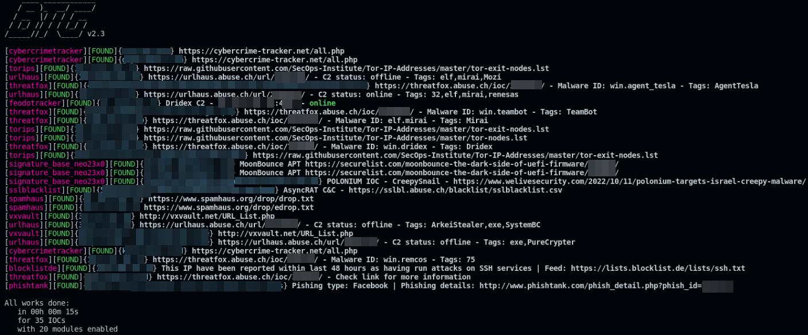

BTG
===

Not every IOC deserve to enter your internal MISP instance, for obvious
quality reasons. But it may be usefull for you analyst to be able to do
a broader research on IOC published online.

This tool allows you to qualify one or more potential malicious
observables of various type (URL, MD5, SHA1, SHA256, SHA512, IPv4, IPv6,
domain etc..). You can run this tool with a Linux environement.

   BTG Demo

The `first versions <https://github.com/conix-security/BTG>`__ were
developed by Conix collaborators. `This
fork <https://github.com/Maxou56800/BTG>`__ aims to keep this project
updated by the community, for the community. Suggestions for
improvement, new contributors are welcome !

Many knowledge-bases of malicious known activity (aka
`IOC <https://en.wikipedia.org/wiki/Indicator_of_compromise>`__) are
accessible online on various website like
`VirusTotal <https://virustotal.com>`__,
`MalwareBazaar <https://bazaar.abuse.ch>`__ etc. SOC and CERT can also
have their own internal database such as
`MISP <http://www.misp-project.org>`__,
`OpenCTI <https://github.com/OpenCTI-Platform/opencti>`__,
`MWDB <https://github.com/CERT-Polska/mwdb-core>`__ etc.

**Daily tasks for SOC and DFIR analysts is therefore marked out by the
research of data like IP addresses, hashs, domains; on these private or
public knowledge-bases; these are repetitive and time-consuming
actions.**

Demo
----

|asciicast|

Module list
~~~~~~~~~~~

With API keys
^^^^^^^^^^^^^

::

   AbuseIPDB
   Cuckoo Sandbox
   GoogleSB
   HybridAnalysis
   Malshare
   MetaDefender
   MISP
   MISP (Crawler)
   MWDB
   OpenCTI
   Otx
   Pulsedive
   Viper
   Virusshare
   VirusTotal

Without API keys
^^^^^^^^^^^^^^^^

::

   Blocklist.de
   CybercrimeTracker
   FeodoTracker
   FortiguardWebFilter
   IRISH
   MalwareBazaar
   MalwareConfig
   Openphish
   PhishTank
   Signature-base (by @Neo23x0)
   Spamhaus
   SSLBlacklist
   ThreatFox
   Tor (exit/relay)
   urlHaus
   urlscan
   VTSysinternals
   VXVault
   VXVaultQuery

Installation
~~~~~~~~~~~~

Install redis server
^^^^^^^^^^^^^^^^^^^^

BTG needs a redis server. You can install it on the same host:

::

   $ sudo apt install redis-server

Install requirements and clone the project
^^^^^^^^^^^^^^^^^^^^^^^^^^^^^^^^^^^^^^^^^^

::

   $ sudo apt update && sudo apt install python3 python3-pip git
   $ git clone https://github.com/conix-security/BTG

Install using poetry
^^^^^^^^^^^^^^^^^^^^

You can install BTG and dependencies inside poetry environnement:

::

   $ curl -sSL https://install.python-poetry.org | python3 -
   $ cd BTG
   $ poetry install
   $ poetry run python3 setup.py install

Install dependencies using standard requirements.txt
^^^^^^^^^^^^^^^^^^^^^^^^^^^^^^^^^^^^^^^^^^^^^^^^^^^^

You can install BTG in **/usr/bin/btg** theses commands:

::

   $ sudo pip3 install -r requirements.txt
   $ sudo python3 setup.py install

Configure BTG
^^^^^^^^^^^^^

You need to configure BTG by editing configuration file **btg.cfg**
using your favorite editor:

::

   $ vim ~/.config/BTG/btg.cfg

Enable or disable modules using **True**/**False** value, and speciffy
API keys for some modules. Carefully read the comments attached to the
configuration variables.

Basic usage
~~~~~~~~~~~

If you use poetry for installation, you can run btg using **poetry run**

Exemple:

::

   $ cd BTG
   $ poetry run btg http://mydomain.com 1a72dca1f6a961f528007ef04b6959d8 45.34.191.173

If you installed BTG using the second method:

.. code:: bash

   $ btg http://mydomain.com 1a72dca1f6a961f528007ef04b6959d8 45.34.191.173

Help
~~~~

::

   usage: btg [-h] [-d] [-o] [-s] [-e] [-j] observable [observable ...]

   Observable to qualify

   positional arguments:
     observable     Type: [URL,MD5,SHA1,SHA256,SHA512,IPv4,IPv6,domain] or a file containing one observable per line

   options:
     -h, --help     show this help message and exit
     -d, --debug    Display debug informations
     -o, --offline  Set BTG in offline mode, meaning all modulesdescribed as online (i.e. VirusTotal) are desactivated
     -s, --silent   Disable MOTD
     -e, --extend   Enable observable extension, meaning BTG will try to find related observable, for instance: domain -> subdomains
     -j, --json     Asking for a JSON output to the given path, at variable json_folder in btg.cfg. Otherwise, default folder is /tmp/BTG/json

Specific config file
^^^^^^^^^^^^^^^^^^^^

If you need to use a specific config file for searching your IOCs, use
the environment variable **BTG_CONFIG**:

::

   $ BTG_CONFIG="/my/custom/btg.cfg" btg

Contributors
~~~~~~~~~~~~

-  Lancelot Bogard
-  Tanguy Becam
-  Alexandra Toussaint
-  Hicham Megherbi
-  Robin Marsollier

.. |asciicast| image:: https://asciinema.org/a/BpWztU8lDtFd5cXLivVL83Px3.png
   :target: https://asciinema.org/a/BpWztU8lDtFd5cXLivVL83Px3
